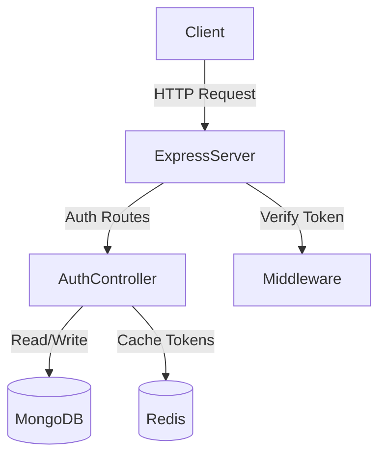

# Authentication Server

## Description
This server handles user authentication using JWT, MongoDB, and Redis. It provides endpoints for user registration, login, and token management.

## Architecture

## Setup
1. `npm install`
2. Configure `.env`
3. `npm run authServer` (for auth routes) or `npm run dev` (for protected test routes)
