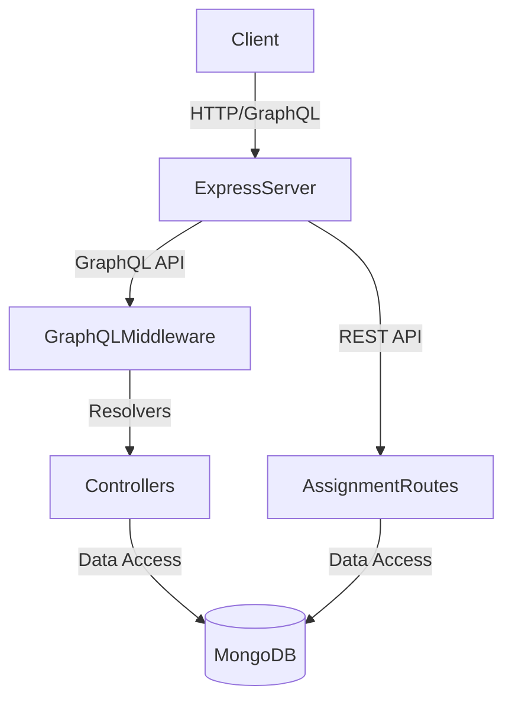

# Backend Server

## Description
The main backend server for the Classmate application. It handles core logic for courses, enrollments, assignments, and submissions using both REST and GraphQL APIs.

## Architecture

## Key Features
- **GraphQL API**: `/graphql` for querying courses, users, etc.
- **REST API**: `/api/v1/` for specific assignment actions.
- **Middleware**: Authentication and role-based access control (Student/Teacher).

## Setup
1. `npm install`
2. `npm run dev`
