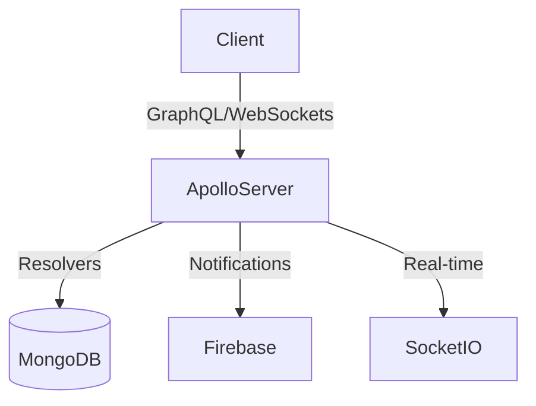

# GraphQL Server

## Description
The GraphQL server powers real-time interactions and specific data queries for the Classmate platform.

## Architecture

## detailed Guides
- **Architecture Overview**: [architecture-overview.md](docs/graphql-server/architecture-overview.md)
- **Chat System**: [chat-system-guide.md](docs/graphql-server/chat-system-guide.md)
- **Attendance System**: [attendance-system-guide.md](docs/graphql-server/attendance-system-guide.md)
- **Forum System**: [forum-system-guide.md](docs/graphql-server/forum-system-guide.md)

## Setup
1. `npm install`
2. `npm run dev`
