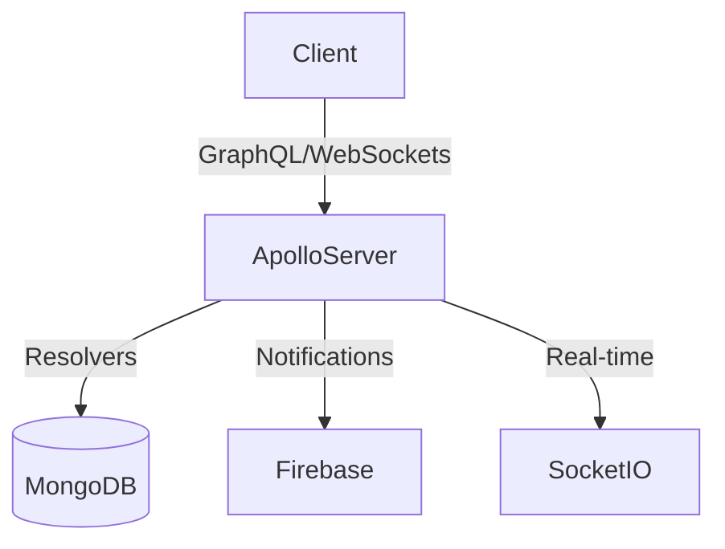

# GraphQL Server

## Description
The GraphQL server powers real-time interactions and specific data queries for the Classmate platform.

## Architecture

## Key Modules
- **Chat System**: See `docs/graphql-server/CHAT_SYSTEM_GUIDE.md`
- **Attendance**: See `docs/graphql-server/ATTENDANCE_SYSTEM.md`

## Setup
1. `npm install`
2. `npm run dev`
