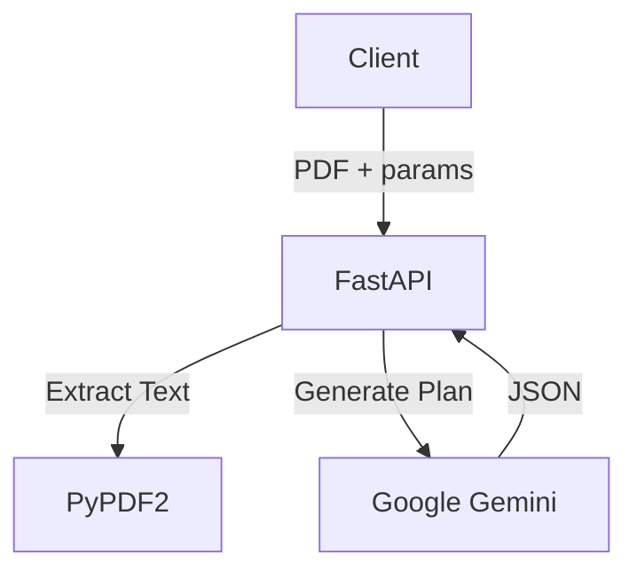

# Lecture Planner

## Description
A FastAPI service that generates comprehensive lecture plans from PDF course materials using Gemini AI.

## Architecture

## Key Features
- **PDF Extraction**: Extracts text from uploaded course materials.
- **AI Planning**: Generates structured lecture plans with topics, objectives, and activities.
