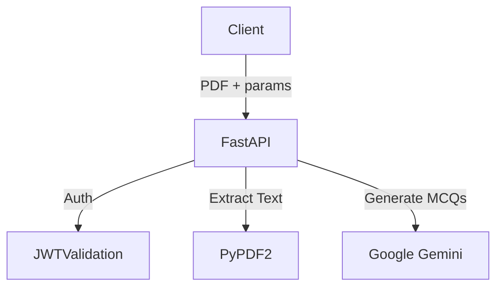

# Question Generator

## Description
A FastAPI service for generating Multiple Choice Questions (MCQs) from PDF documents.

## Architecture

## Key Features
- **Role-Based Access**: Teachers can generate questions efficiently.
- **difficulty levels**: Easy, Medium, Hard.
