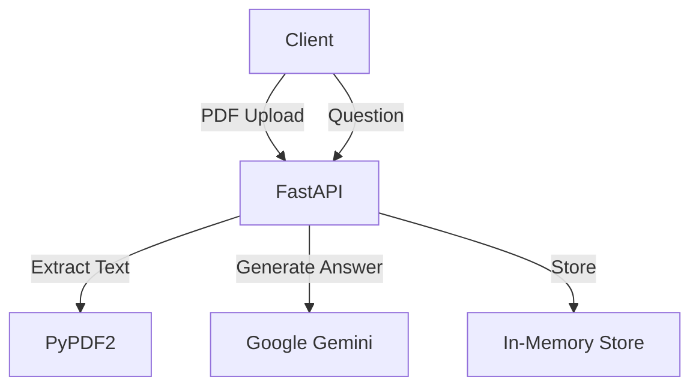

# RAG Server (PDF Knowledge Base)

## Description
A FastAPI-based service for RAG (Retrieval-Augmented Generation) on PDF documents using Google Gemini AI.

## Architecture

## Endpoints
- `POST /upload-pdf`: Upload a PDF to create a knowledge base.
- `POST /ask`: Ask a question contextually dependent on a knowledge base.

## Documentation
- Detailed API Reference: [api-reference.md](docs/rag-server/api-reference.md)
